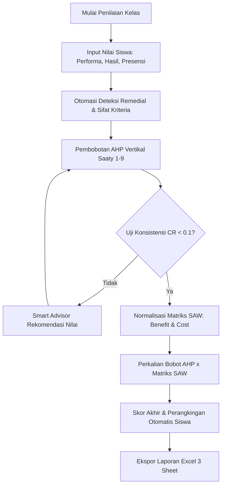

<div align="center">

# 📊 SCORIFY
### Sistem Pendukung Keputusan (SPK) Penilaian & Perangkingan Siswa berbasis AHP & SAW

[](https://flutter.dev)
[](https://dart.dev)
[](https://firebase.google.com)
[](https://www.android.com)

<p align="center">
  Aplikasi mobile modern untuk membantu guru dan pendidik dalam mengevaluasi, membobot kriteria penilaian, dan merangking prestasi belajar siswa secara objektif, akuntabel, dan transparan.
</p>

</div>

---

## 🌟 Fitur Utama

### 1. 🎯 Fleksibilitas Kategori Kriteria Penilaian
Mendukung 3 jenis kriteria penilaian terpadu:
* 🟢 **Kriteria Performa:** Dinilai langsung saat KBM (*on-the-spot*), mencakup **Poin Tambahan (+)** untuk keaktifan/sikap atau **Nilai Angka (0–100)** untuk unjuk kerja/praktik/presentasi.
* 🔵 **Kriteria Hasil:** Dinilai setelah evaluasi terstruktur per sesi (Tugas, Kuis, UTS, UAS) dengan dukungan sesi jamak dan pencatatan remedial (*retake*).
* 🟠 **Kriteria Perhitungan Remedi (*Derived Cost Criteria*):** Dihitung otomatis oleh sistem dari frekuensi pengulangan ujian (*attempt > 1*) pada kriteria tugas/ujian yang dipilih oleh guru, diperlakukan secara adil sebagai kriteria beban (*Cost*).
* ⏱️ **Kriteria Presensi & Proteksi Jam KBM:** Format kehadiran fleksibel (persentase, akumulasi hari, atau poin kehadiran) dengan validasi waktu nyata agar absensi hanya dapat diisi pada jam KBM kelas yang sah.

### 2. ⚖️ Pembobotan Kriteria dengan AHP (*Analytic Hierarchy Process*)
* **Model Perbandingan Vertikal:** Tampilan kartu perbandingan berpasangan vertikal yang intuitif dan ramah layar ponsel tanpa tabel matriks lebar.
* **Skala Preferensi Saaty:** Menggunakan skala fundamental 1–9 Saaty.
* **Uji Konsistensi Otomatis:** Menghitung nilai $\lambda_{\max}$, *Consistency Index* (CI), dan *Consistency Ratio* (CR).
* **Smart Inconsistency Advisor:** Memberikan rekomendasi revisi nilai sel perbandingan secara otomatis jika matriks inkonsisten ($CR \ge 0.1$).

### 3. 🏆 Perangkingan Alternatif dengan SAW (*Simple Additive Weighting*)
* **Normalisasi Matriks Keputusan ($R$):** Penyesuaian terpisah untuk kriteria **Benefit** (maksimasi $\uparrow$) dan **Cost** (minimasi $\downarrow$).
* **Agregasi Bobot AHP:** Perkalian matriks ternormalisasi dengan bobot preferensi kriteria ($W$) hasil AHP.
* **Skor Akhir & Pemeringkatan ($V$):** Menghasilkan skor akhir terukur (0.00 – 1.00) dan mengurutkan peringkat siswa dari ranking tertinggi secara otomatis.

### 4. 🤖 Asisten Scorify Cerdas (100% Offline Assistant)
* **Konsultasi Mekanisme Kapan Saja:** Chatbot interaktif lokal yang membantu guru memahami logika SPK, rumus normalisasi, aturan remedial, uji konsistensi AHP, hingga format Excel.
* **100% Bekerja Tanpa Internet:** Tidak bergantung pada API pihak ketiga, bebas biaya token/kuota, dan respon seketika (bebas *latency* & bebas halusinasi).
* **Domain Guardrails:** Diprogram khusus untuk menjawab pertanyaan seputar konteks operasional Scorify.
* **Akses Cepat (Floating Action Button):** Tombol melingkar modern dengan ikon robot di menu Panduan untuk konsultasi instan.

### 5. 📊 Manajemen Data & Ekspor Excel Multi-Sheet
* **Import Data Siswa:** Unggah daftar siswa secara instan dari file Excel (`.xlsx`) lengkap dengan unduhan template 2 kolom (NIS & Nama Siswa).
* **Kompatibilitas Android Scoped Storage:** Dukungan penyimpanan adaptif yang aman untuk Android 10+ (API 29 hingga Android 14+) tanpa kendala izin penyimpanan (*Permission Denied*).
* **Laporan Excel Komprehensif (3 Sheet):**
  * 📄 **Sheet 1 (*Rekap & Ranking*):** NIS, Nama Siswa, seluruh kolom nilai kriteria dinamis, Skor Akhir SAW, dan Ranking.
  * 📄 **Sheet 2 (*Riwayat Remedial*):** Log audit jejak perbaikan nilai siswa per sesi (Attempt 1 vs Attempt 2, tanggal, dan status kelulusan).
  * 📄 **Sheet 3 (*Metadata Kriteria*):** Catatan jenis kriteria, bobot AHP, dan sifat kriteria (*benefit*/*cost*).

### 6. 🔐 Keamanan Akun & Account Linking
* **Autentikasi Ganda:** Masuk cepat lewat tombol *"Login with Google"* atau formulir mandiri Email & Kata Sandi.
* **Account Linking Kata Sandi:** Fitur bagi pengguna Google Sign-In untuk membuat kata sandi akun di menu Profil, sehingga pengguna dapat berganti email dengan aman tanpa risiko terkunci dari akun (*lockout*).
* **Reset Kata Sandi Terbimbing:** Panduan lupa sandi yang informatif dengan instruksi pengecekan folder Spam Gmail.

---

## 📐 Metodologi SPK



### 1. Analytic Hierarchy Process (AHP)
1. **Normalisasi Matriks Perbandingan:**
   $$r_{ij} = \frac{a_{ij}}{\sum_{k=1}^{n} a_{kj}}$$
2. **Perhitungan Vektor Bobot Kriteria ($w_i$):**
   $$w_i = \frac{1}{n} \sum_{j=1}^{n} r_{ij}$$
3. **Consistency Index & Ratio:**
   $$CI = \frac{\lambda_{\max} - n}{n - 1}, \quad CR = \frac{CI}{RI}$$
   *(Matriks dinyatakan valid & konsisten jika $CR < 0.1$)*

### 2. Simple Additive Weighting (SAW)
1. **Normalisasi Matriks Keputusan ($R_{ij}$):**
   * Kriteria **Benefit**:
     $$R_{ij} = \frac{x_{ij}}{\max_k(x_{kj})}$$
   * Kriteria **Cost**:
     $$R_{ij} = \frac{\min_k(x_{kj})}{x_{ij}}$$
2. **Perhitungan Nilai Preferensi / Skor Akhir ($V_i$):**
   $$V_i = \sum_{j=1}^{m} w_j \cdot R_{ij}$$

---

## 🛠️ Tech Stack & Dependencies

* **Framework:** [Flutter](https://flutter.dev/) (Channel Stable, Dart SDK ^3.11.5)
* **State Management:** [Provider](https://pub.dev/packages/provider)
* **Database & Auth:** [Firebase Auth](https://pub.dev/packages/firebase_auth), [Cloud Firestore](https://pub.dev/packages/cloud_firestore), [Google Sign-In](https://pub.dev/packages/google_sign_in)
* **Spreadsheet Engine:** [Excel](https://pub.dev/packages/excel), [CSV](https://pub.dev/packages/csv), [File Picker](https://pub.dev/packages/file_picker)
* **Storage & Sharing:** [Path Provider](https://pub.dev/packages/path_provider), [Share Plus](https://pub.dev/packages/share_plus), [Open Filex](https://pub.dev/packages/open_filex), [Permission Handler](https://pub.dev/packages/permission_handler)
* **Typography & UI:** [Google Fonts (Plus Jakarta Sans)](https://pub.dev/packages/google_fonts), [Cupertino Icons](https://pub.dev/packages/cupertino_icons)

---

## 🚀 Memulai (Getting Started)

### Prasyarat
* [Flutter SDK](https://docs.flutter.dev/get-started/install) (versi 3.19 ke atas disarankan)
* Android Studio / VS Code dengan ekstensi Flutter & Dart
* Perangkat Android fisik (Android 8.0 Oreo s.d. Android 14+) atau Emulator

### Instalasi & Menjalankan Aplikasi

1. **Clone Repositori:**
   ```bash
   git clone https://github.com/PZYCHU/SCORIFY.git
   cd scorify
   ```

2. **Pasang Dependensi:**
   ```bash
   flutter pub get
   ```

3. **Jalankan Aplikasi (Mode Debug):**
   ```bash
   flutter run
   ```

4. **Build APK Release:**
   ```bash
   flutter build apk --release
   ```
   *File output APK akan tersedia di: `build/app/outputs/flutter-apk/app-release.apk`*

---

## 📁 Struktur Direktori Proyek

```text
scorify/
├── android/                   # Konfigurasi native Android & Gradle
├── assets/                    # Gambar, aset ilustrasi, dan icon
├── lib/
│   ├── models/                # Data model (Kelas, Kriteria, Murid, Nilai, Sesi)
│   ├── providers/             # State management (AppProvider)
│   ├── screens/
│   │   ├── ahp/               # Antarmuka pembobotan AHP vertikal & uji CR
│   │   ├── assistant/         # Layar obrolan Asisten Scorify (Offline Chatbot)
│   │   ├── class/             # Manajemen kelas, sesi penilaian, & input kolektif
│   │   ├── kalkulasi/         # Tampilan matriks SAW & hasil perankingan
│   │   ├── login_regist/      # Autentikasi guru, registrasi, & lupa kata sandi
│   │   ├── profile/           # Profil guru, ganti email, & account linking kata sandi
│   │   ├── student/           # Import Excel daftar murid & kartu siswa
│   │   └── tutorial_screen.dart # Pusat panduan terpadu & FAQ interaktif
│   ├── services/
│   │   ├── assistant_service.dart # Basis pengetahuan & keyword engine asisten offline
│   │   ├── auth_service.dart      # Autentikasi Firebase & Account Linking
│   │   ├── excel_service.dart     # Engine unduh template & ekspor laporan multi-sheet
│   │   ├── firestore_service.dart # Sinkronisasi cloud data penilaian kelas
│   │   └── spk_service.dart       # Algoritma perhitungan AHP & SAW
│   ├── theme/                 # Tema warna (Teal, Sage, Emerald) & typography
│   ├── utils/                 # Format tanggal, angka, dan helper pendukung
│   ├── widgets/               # Komponen UI reusable (Card, Chip, Button, Sheet)
│   └── main.dart              # Entry point inisialisasi aplikasi
└── pubspec.yaml               # Konfigurasi dependensi paket & aset
```

---

## 👨‍💻 Pengembang

* **Malika Pradnya Hapsari** ([@PZYCHU](https://github.com/PZYCHU))  
  *Program Studi Sistem Informasi / Ilmu Komputer — Skripsi / Tugas Akhir*

---

<div align="center">
  <sub>Dibangun dengan haha ape jir menggunakan Flutter & Firebase</sub>
</div>
